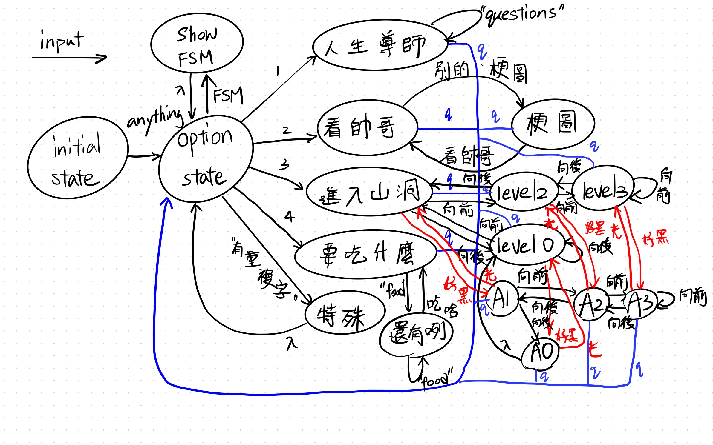

# casper的超ㄅㄧㄤˋ聊天機器人
# 主要功能：
1. 《人生導師》
2. 《看帥哥》
3. 《進入山洞》
4. 《要吃什麼？》

## 功能簡介：
### 1. 《人生導師》
這個功能可以幫你聯絡一位神秘人士，讓你問問題或是聊聊天。《人生導師》可以流暢、精準地回覆你任何問題。
（英文為主）
### 2. 《看帥哥》
進入這個功能，就可以收到出乎意料的照片。
### 3. 《進入山洞》
因為走到山洞的內部，所以你傳送的訊息都會有「回音」，文字上的回音或是聲音上的回音。
### 4. 《要吃什麼？》
只要給予選項，他就會幫你挑出一個很棒的晚餐，完全解決現代人的選擇障礙。

## 詳細操作：
### <環境架設>
1. 下載檔案
2. 在terminal中執行 ngrok http 8000
3. 將ngrok的連結copy到line developer以及test.py當中
4. 將line的channel access token 以及channel secret設定成env
5. 接下來就可以執行程式

### 加好友，進入linebot

**基本操作：**
* 先傳送"hi", "哈嘍"等訊息將其喚醒，你會獲得選項
* 可以輸入選項（ex. "1", "2"），進入不同的功能
* 任何時候輸入"q"，都可以退回到最初的選項訊息

**《人生導師》**
（你輸入"1"進到這裡面）
* 可以輸入任何問題，盡量以英文為主（ex. "what is earth?"），之後就可以獲得回覆
* 隨時輸入"q"就可以退出。

**《看帥哥》**
* 會傳送你的大頭貼給你。
* 如果你傳“梗圖”或“別的”，linebot就會改傳梗圖給你，目前兩張。
* 如果你傳“帥”，則會回到原本傳大頭貼的模式。

**《進入山洞》**
* 會進入山洞，按照深入程度會影響回音的量。
* 傳訊息，linebot會以回音的方式回覆。
* 如果你傳“向前走”，那麼深入程度就會加一。
* 如果你傳“向後走”，那麼深入程度就會減一。
* 如果你傳“好黑”或“看不見”，那linebot就會改用語音的方式產生回音。
* 如果你傳"打火機"、“電燈”、“陽光”，那linebot就會改用訊息回覆。

**《要吃什麼？》**
* 依序輸入你的晚餐選項，全部輸入完之後，傳“吃啥”。
* linebot會幫你做決定，今天晚餐吃什麼

**《特殊》**
* 在一開始的選擇訊息中，如果傳“要不要喝飲料”等，會出現特殊回覆。
* 在一開始的選擇訊息中，如果傳“FSM”，可以得到lineBot的FSM。

### 額外項目
* 特殊line api
* 使用者大頭照、使用者名字
* Azure
* 語音訊息
* 圖像訊息
* 語音合成
* chatGPT
